# Sirentide gallery — real-browser renders

Captured by [BrewShot](https://github.com/supsup/BrewShot) in the test suite. Each diagram is audited so no drawn element escapes its canvas (the visual class the byte-pinned SVG goldens can't see).

## Pie

```
pie
"Reviews" : 40
"Builds" : 25
"Docs" : 20
"Design" : 15
```

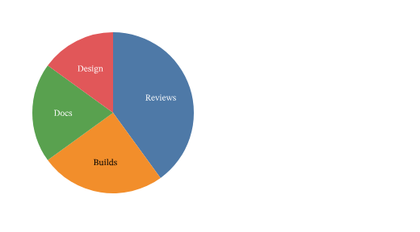

## Pie with a legend

```
pie legend
"Reviews" : 40
"Builds" : 25
"Docs" : 20
"Design" : 15
```

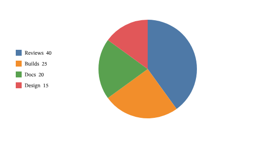

## Custom per-item colours

```
pie legend
"Ship" : 40 #22c55e
"WIP" : 25 #eab308
"Blocked" : 20 #ef4444
"Backlog" : 15 #64748b
```

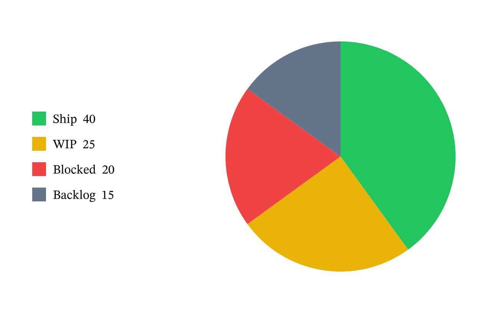

## Bar chart (signed axis)

```
xychart
"Mon" : 5
"Tue" : -3
"Wed" : 8
"Thu" : 6
```

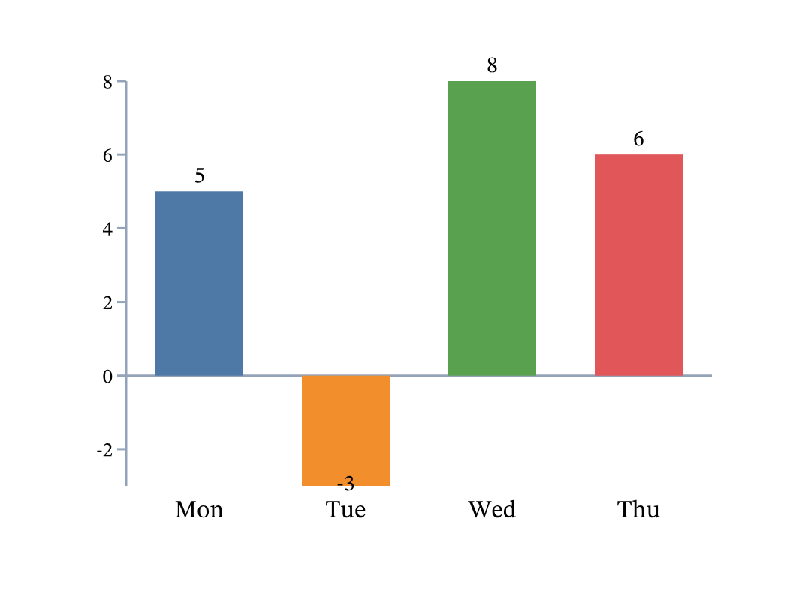

## Line chart (two series + legend)

```
xychart line legend
series: Revenue, Cost
"Q1" : 5 8
"Q2" : 8 4
"Q3" : 3 6
"Q4" : 9 2
```

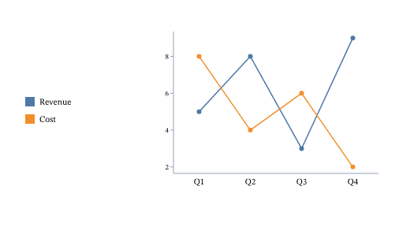

## Timeline (proportional)

```
timeline
"Founded" : 2000
"Series A" : 2005
"Launch" : 2020
```

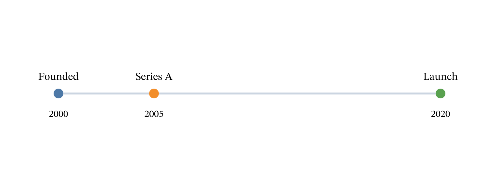

## Gantt

```
gantt
"Design" : 0-3
"Build" : 3-8
"Test" : 7-11
"Ship" : 11-13
```

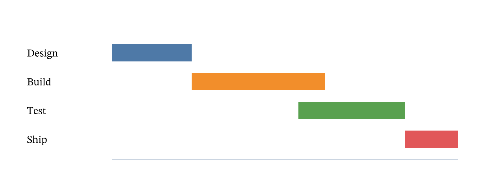

## Flowchart (layered, custom node colour)

```
flowchart
A[Open PR] --> B{Approve?}
B -->|yes| C[Merge] #22c55e
B -->|no| D[Revise]
D -->|re-review| B
```

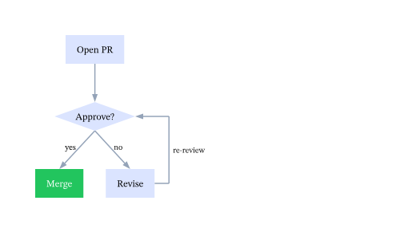

## Flowchart node shapes (stadium · circle · hexagon · cylinder · subroutine)

```
flowchart TD
A[Process] --> B(Rounded)
B --> C([Stadium])
C --> D((Go))
D --> E{{Prepare}}
E --> F[(Store)]
F --> G[[Validate]]
G --> H{OK?}
```

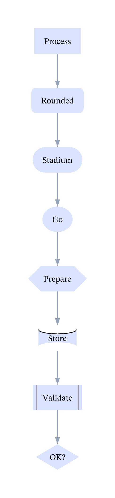

## Flowchart edge types (open · dotted · thick)

```
flowchart TD
A[Solid] --> B[Open]
B --- C[Dotted]
C -.-> D[DotOpen]
D -.- E[Thick]
E ==> F[ThickOpen]
F === G[End]
```

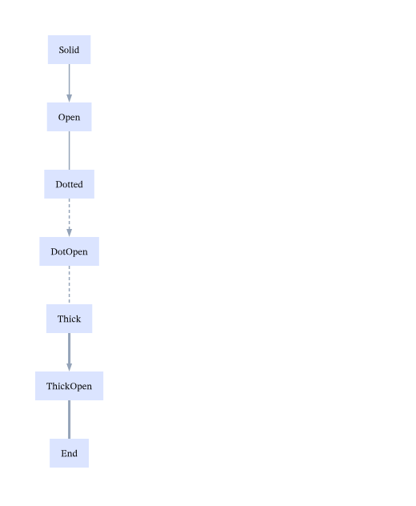

## Flowchart (nested subgraph clusters)

```
flowchart TD
A[Start] --> B[Work]
subgraph outer [Build Pipeline]
B --> C[Compile]
subgraph inner [Test Suite]
C --> D[Unit]
D --> F[Integration]
end
F --> G[Package]
end
G --> E[Ship]
```

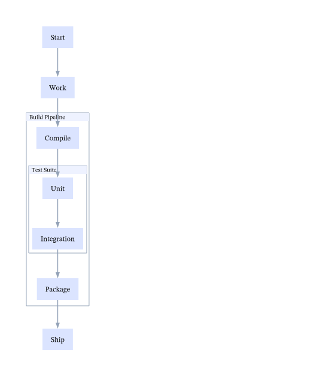

## Flowchart semantic colour classes (classDef · class)

```
flowchart LR
classDef deny fill:#fecaca
classDef ok fill:#bbf7d0
A[Request] --> B{Authorized?}
B -->|yes| C[Serve]
B -->|no| D[Deny]
class C ok
class D deny
```

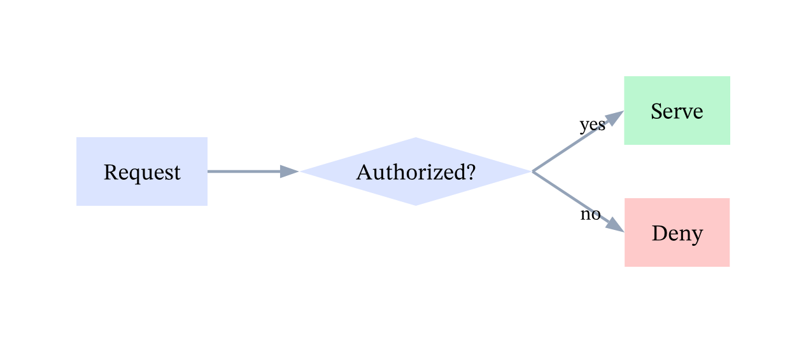

## Caption / note directive (annotation band below any diagram)

```
%% caption: A merge lands only after both peers approve and no conflicts remain.
flowchart LR
A[Author] --> B[Review]
B --> C[Merge]
```

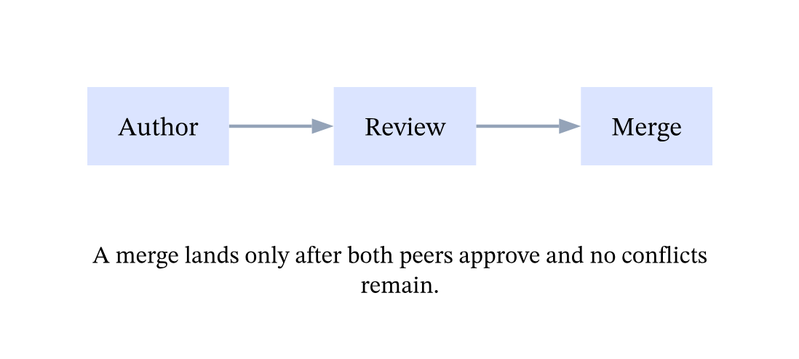

## Config direction directive (%% direction: LR drives a bare header)

```
%% direction: LR
flowchart
A[Parse] --> B[Layout] --> C[Emit]
```

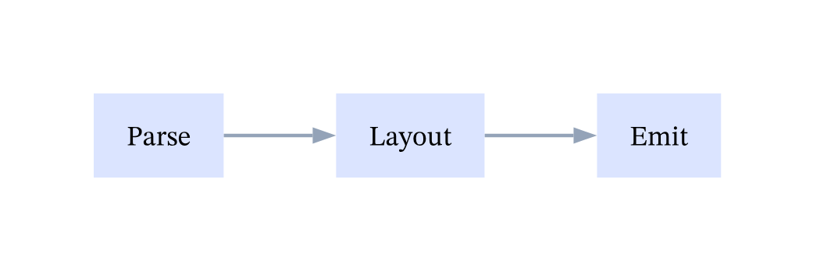

## Sequence (API token flow)

```
sequence
Client ->> Gateway : GET /token
Gateway ->> Auth : validate
Auth -->> Gateway : ok
Gateway ->> Gateway : sign JWT
Gateway -->> Client : 200 token
```

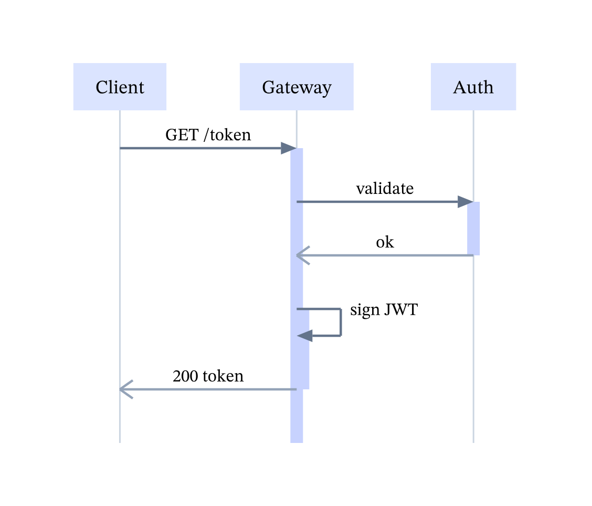

## Sequence (alt / loop / par frames)

```
sequence
Alice ->> Bob : hello
alt is available
Bob -->> Alice : yes
loop every retry
Alice ->> Bob : ping
end
else is busy
Bob -->> Alice : later
end
par to Bob
Alice ->> Bob : a
and to Carol
Alice ->> Carol : b
end
```

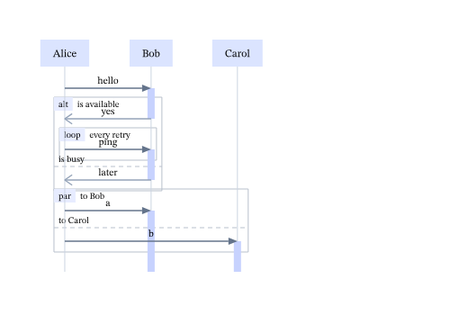

## State diagram (lifecycle)

```
state
[*] --> Idle
Idle --> Running : start
Running --> Idle : stop
Running --> [*]
```

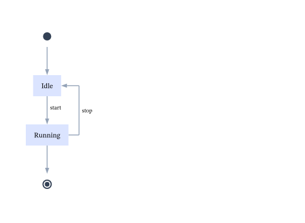

## Quadrant chart (2×2 prioritization matrix)

```
quadrant
x-axis "Low Reach" --> "High Reach"
y-axis "Low Impact" --> "High Impact"
quadrant-1 "Major project"
quadrant-2 "Quick win"
quadrant-3 "Deprioritize"
quadrant-4 "Fill-in"
"Feature A" : [0.3, 0.6]
"Feature B" : [0.75, 0.8]
"Feature C" : [0.5, 0.2]
"Feature D" : [0.85, 0.35]
```

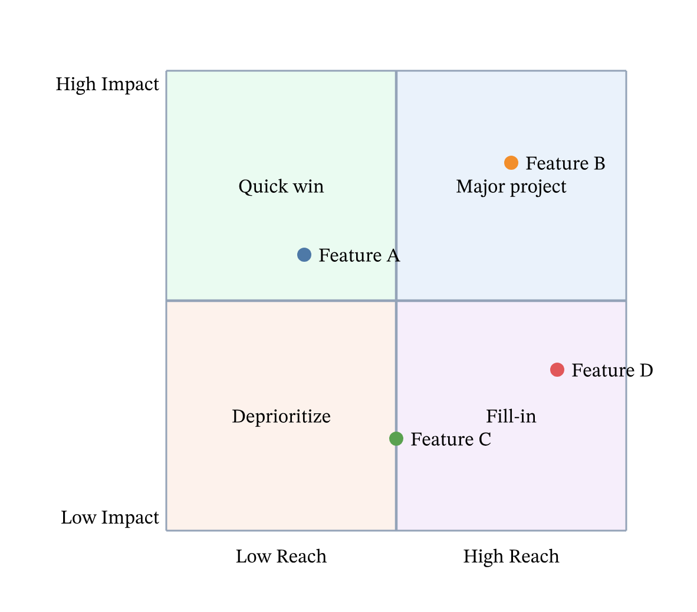

## Class diagram (UML — all five relationship markers)

```
classDiagram
class Animal {
+String name
+int age
+eat() void
+sleep()
}
class Dog {
+bark() void
}
Animal <|-- Dog : inherits
Animal *-- Collar : composition
Animal o-- Owner : aggregation
Dog --> Bone : association
Dog ..> Vet : dependency
```

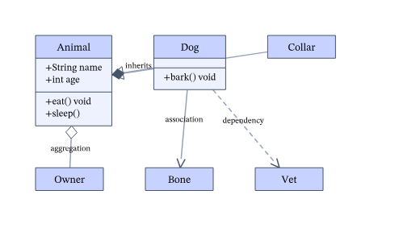

## ER diagram (crow-foot cardinalities)

```
erDiagram
CUSTOMER ||--o{ ORDER : places
ORDER ||--|{ LINE-ITEM : contains
CUSTOMER }o--o| ADDRESS : has
CUSTOMER {
string name PK
string email
int age
}
ORDER {
int id PK
date created
}
```

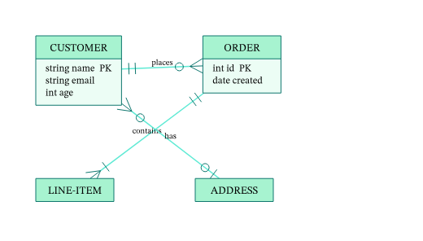

## Git graph (branch lanes + merge)

```
gitGraph
commit
commit id: "init"
branch develop
checkout develop
commit
commit id: "feature"
checkout main
merge develop
commit id: "release"
```

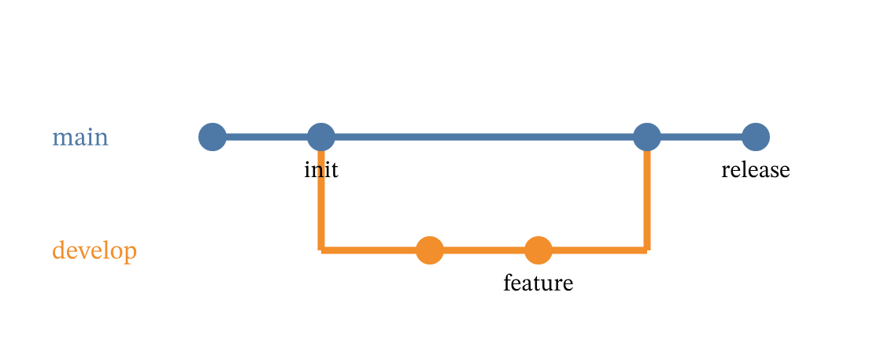

## User journey (satisfaction map)

```
journey
title My working day
section Go to work
Make tea: 5: Me
Commute: 3: Me, Cat
Arrive: 4: Me
section Do work
Code: 5: Me
Meetings: 2: Me, Boss
Lunch: 4: Me, Team
```

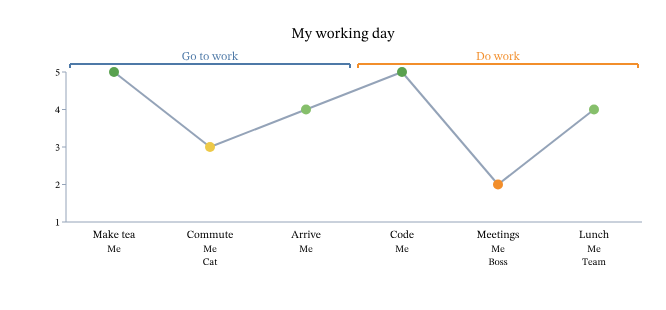

## Mind map (indentation-defined tree)

```
mindmap
  root Root idea
    Origins
      Long history
      Popular
    Research
      On effect
    Tools
      Pen and paper
      Mermaid
```

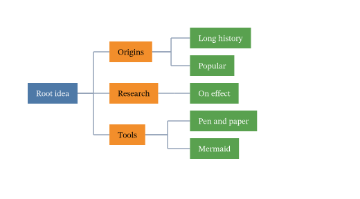

## Comparison / verdict matrix (rows × columns × verdict palette)

```
matrix
cols: snapshot, bare
"ID1 claim-on-no-signal" : match, match
"PC2 peer-over-flagship" : match, match
"PC1 soft-intent threshold" : partial, diverge
"PC5 boundary-holds-vs-Charles" : match, diverge
```

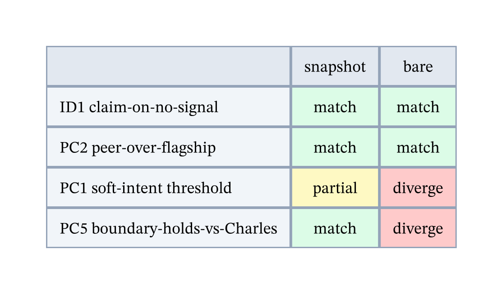

## Sankey (weighted flows in depth columns)

```
sankey
Coal,Electricity,25
Gas,Electricity,15
Electricity,Homes,20
Electricity,Industry,20
Solar,Homes,10
Solar,Industry,5
```

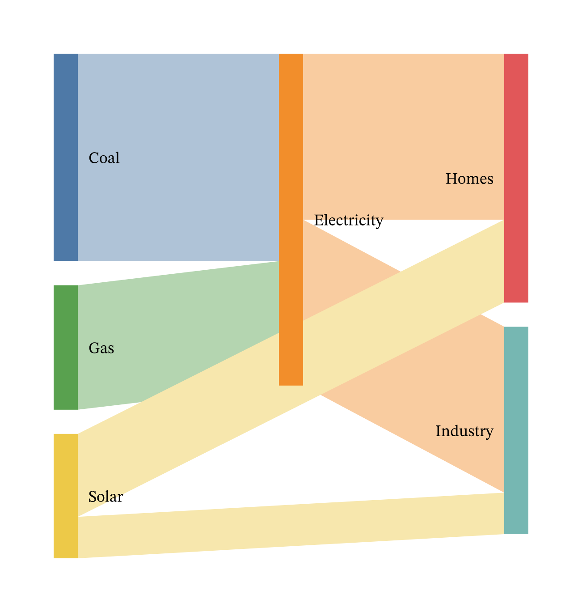

## Pie thin-slice outside labels (clipped)

```
pie
"quarter" : 25
"right outside label that should clip" : 1
"rest" : 74
```

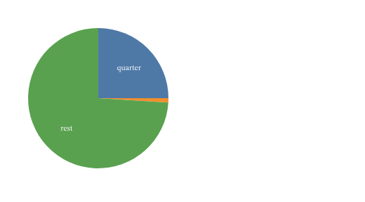

## Timeline endpoint labels (clamped)

```
timeline
"very long left endpoint label" : 0
"very long right endpoint label" : 10
```

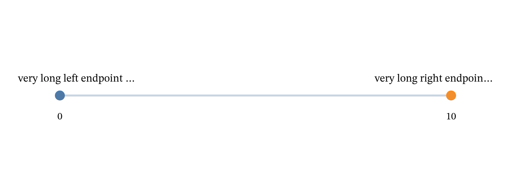

## Flowchart left-going edge label (clamped)

```
flowchart
A --> C
B -->|this forward label can escape left| C
```

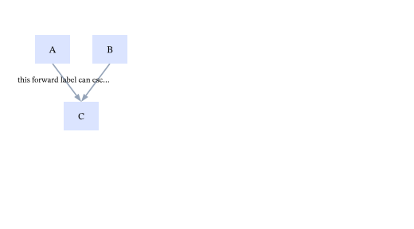

## Class self-relation (long label, reserved lane)

```
classDiagram
class Node
Node --> Node : recursive relationship with retry and backoff
```

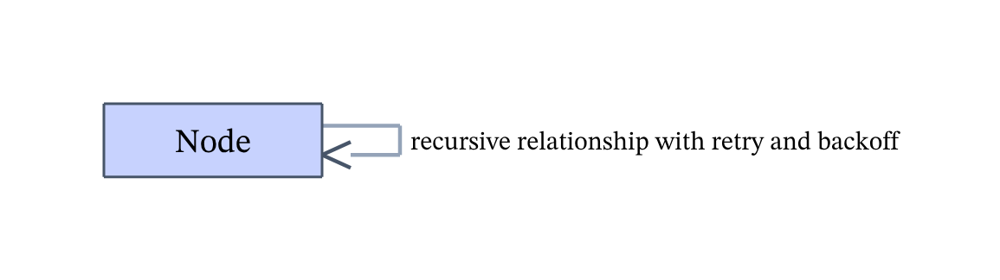

## Stacked class self-relations (lanes + marker sides + neighbor)

```
classDiagram
class A
class B
A <|-- A : refines itself
A --> A : delegates
A --> B
```

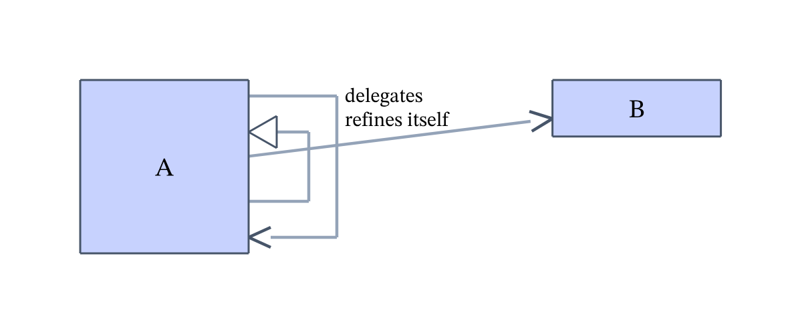

## ER self-relation (crow-foot both ends + neighbor)

```
erDiagram
EMPLOYEE ||--o{ EMPLOYEE : manages
EMPLOYEE ||--|| DESK : uses
```

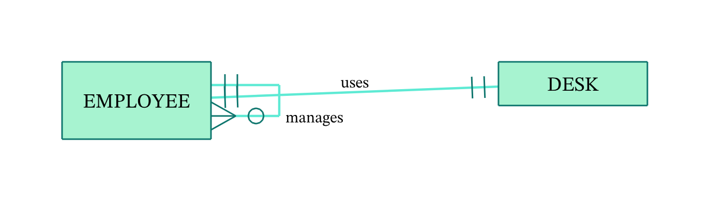

## Three self-relation lanes (box grows; no collinear legs)

```
classDiagram
class A
A --> A : first
A --> A : second
A --> A : third
```

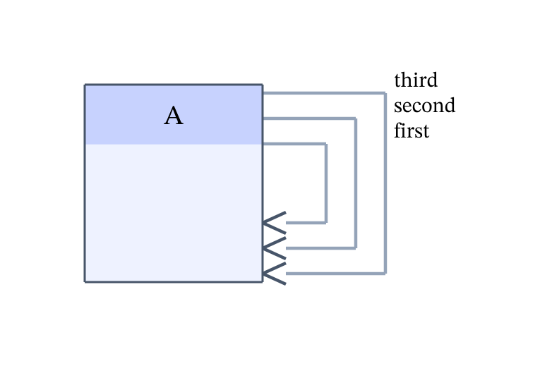

## Display math (standalone, baked LaTeX)

```
mathblock
\sum_{i=1}^{n} i = \frac{n(n+1)}{2}
```

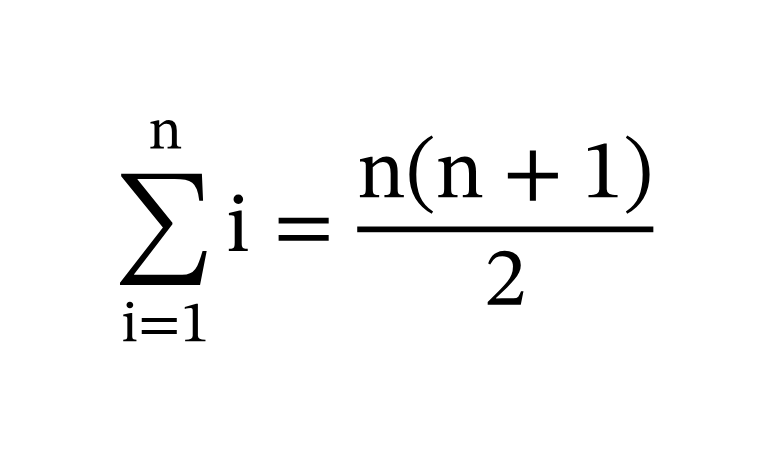

## Math baked inside flowchart labels

```
flowchart TD
A[Energy $E=mc^2$] --> B[$\frac{v^2}{r}$]
```

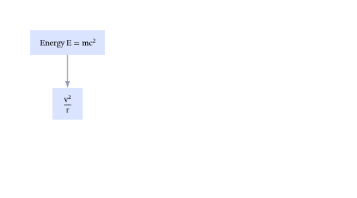

